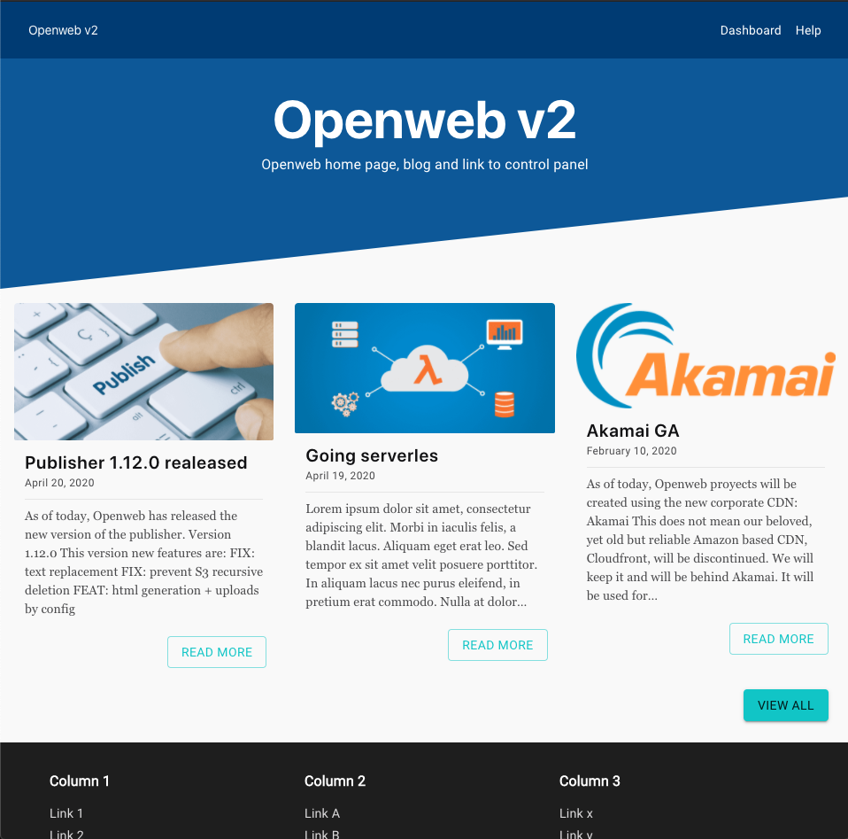
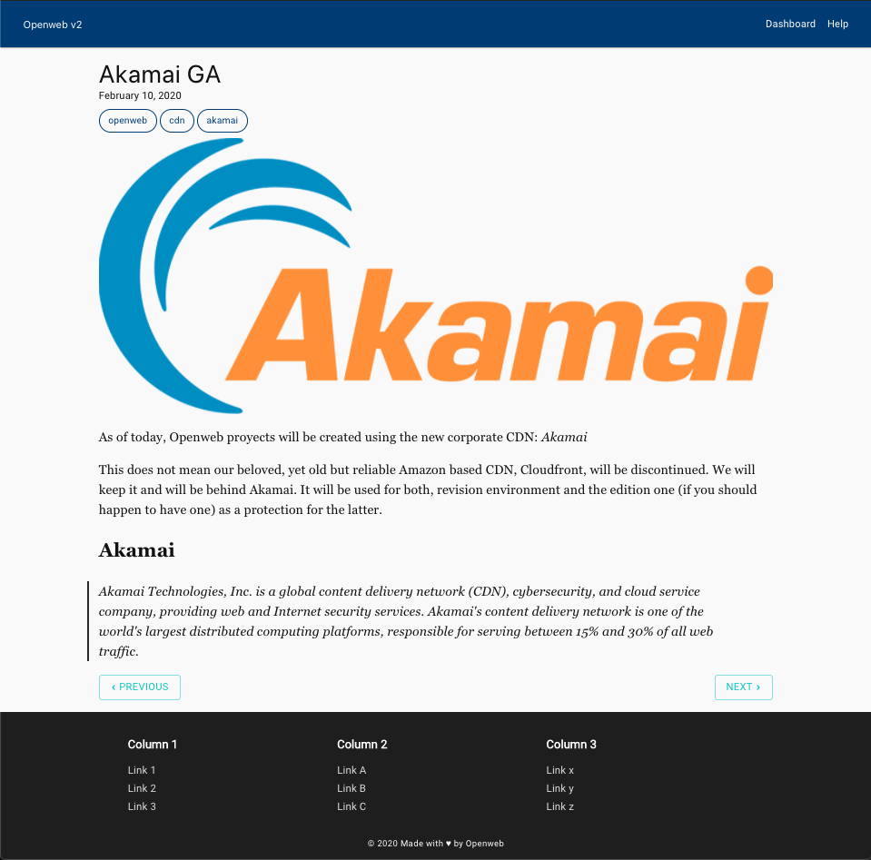
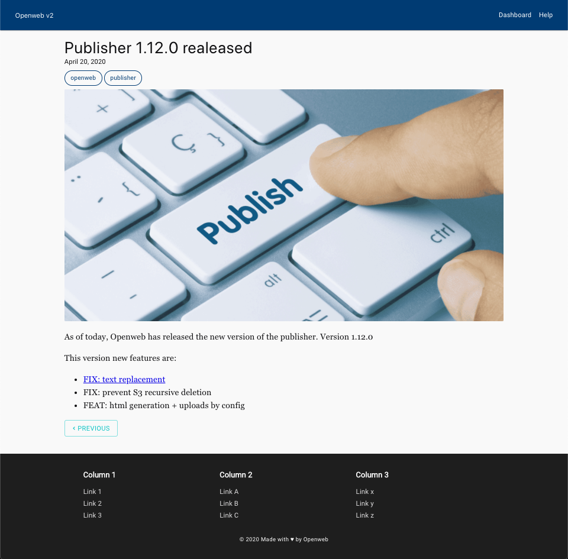
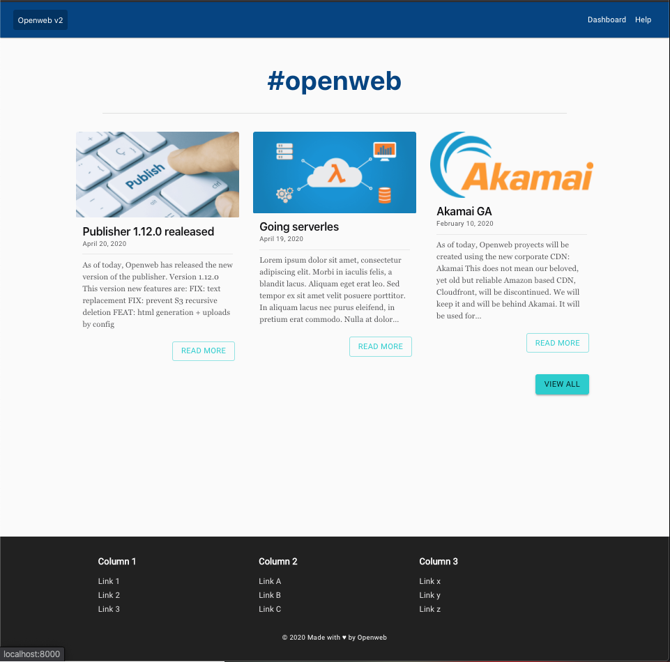

# Gatsby Theme: Openweb based on Sky Lite

## Install dependencies

```bash
yarn # Or, npm install
```

## Start development server

```bash
gatsby develop
```

## Empty cache

```bash
gatsby clean
```

## Build static site

```bash
gatsby build
```

## Screenshots

### HOME



### POSTS




### TAG FILTER

